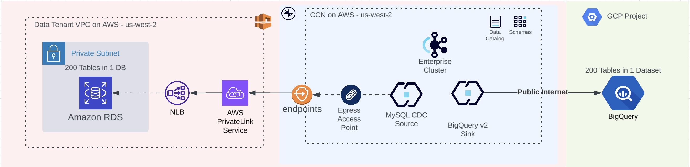

## Migration Pipeline on Confluent Cloud 
#### Transfer CDC Data between MySQL DB on RDS to Bigquery in a realtime, highly secure and scalable way

This repository contains Terraform configurations for CDC Data pipeline from RDS MySQL DB to BigQuery using Confluent Cloud. It aims to provide infrastructure as code (IaC) to manage resources and deploy applications on AWS, GCP and Confluent over private networking and stream governance.
## Architecture


- **AWS**: RDS, RDS Proxy, PrivateLink Service, Network Load balancer, Secrets Manager, EC2, VPC Endpoint, Route53
- **GCP**: BigQuery, IAM
- **Confluent**: PLATT Networking on AWS, BQ & Mysql CDC V2 Connectors, Schema Registry, Enterprise Kafka Cluster

## Pre-requisites

- **Terraform**: [Version](https://www.terraform.io/downloads.html)
  - Install Terraform on your local machine by following the [installation guide](https://learn.hashicorp.com/tutorials/terraform/install-cli).
- **Cloud Provider CLI**: (AWS, GCP & Confluent Cloud)
  - For AWS, refer to the [AWS CLI setup](https://docs.aws.amazon.com/cli/latest/userguide/cli-configure-quickstart.html).
  - For GCP, refer to the [GCP CLI setup](https://cloud.google.com/sdk/docs/install#deb).
  - For Confluent Cloud to the [Confluent CLI setup](https://docs.confluent.io/confluent-cli/current/install.html).
- **Cloud Provider Access**: (AWS, GCP & Confluent Cloud)
    - AWS: ACCESS_KEY & SECRET_KEY - Network Administrator, RDS, KMS, Secret Manager, EC2
    - GCP: Service Account - BigQuery writer, IAM Editor
    - Confluent: Cloud API KEY & SECRET
- **Linux Tools** - mysql client, git, vscode
- **Terraform Cloud/State backend (optional)**: If using a remote backend for storing the Terraform state, ensure that it is set up (e.g., AWS S3, HashiCorp Consul, etc.).


## Initialization

- **Create an EC2 Instance in the data tenant vpc that belongs to a public subnet with a public ip, accessible over SSH**
    ```bash
        aws configure # Provide AWS ACCESS, SECRET & DEFAULT REGION
        
        # See the VPC and subnets
        aws ec2 describe-vpcs --query "Vpcs[].VpcId" --output text
        
        # Select the RDS Tenant VPC and Look for Public subnets
        aws ec2 describe-subnets \
            --filters Name=vpc-id,Values=<your_vpc_id> Name=map-public-ip-on-launch,Values=true \
            --query "Subnets[].SubnetId" --output text
        
        # Create Security group for Confluent bastion
        aws ec2 create-security-group --group-name ConfluentBastionSSHAccessGroup --description "Security group for SSH access"
        aws ec2 authorize-security-group-ingress --group-name ConfluentBastionSSHAccessGroup --protocol tcp --port 22 --cidr 0.0.0.0/0
        aws ec2 authorize-security-group-egress --group-name ConfluentBastionSSHAccessGroup --protocol "-1" --port 0 --cidr 0.0.0.0/0
        
        # Create SSH Key pair for the bastion host 
        aws ec2 create-key-pair --key-name ConfluentBastion --query 'KeyMaterial' --output text > ConfluentBastion.pem
        chmod 400 ConfluentBastion.pem
        
        # Create the EC2 instance in the data tenant VPC and public subnet
        aws ec2 run-instances \
            --image-id ami-05f157b283f1f33b9 \  # Example Ubuntu AMI (ensure it's the correct one for your region - https://cloud-images.ubuntu.com/locator/ec2/)
            --count 1 \
            --instance-type t3.large \  # Choose the instance type (t2.micro is eligible for the free tier)
            --key-name ConfluentBastion \  # The SSH key pair you created earlier
            --security-groups ConfluentBastionSSHAccessGroup \  # The security group with SSH access
            --subnet-id <subnet_id> \  # Public subnet ID from the list you obtained
            --associate-public-ip-address  # Ensure the EC2 instance gets a public IP
    ```
- **In the VSCode, Connect the EC2 instance bastion over SSH**
    ```bash 
    # ~/.ssh/config
    Host AWS_CONFLUENT_BASTION
        HostName <EC2-PUBLIC-ENDPOINT>
        User ubuntu
        IdentityFile <ABSOLUTE-PATH-TO-ConfluentBastion.pem>
    ```
- **Once inside the vscode, clone the repository**
    ```bash 
    git clone https://github.com/flashiam12/migration-pipeline.git
    cd migration-pipeline
    
    code .

    # Install gcloud, confluent, aws and terraform CLI 

    aws configure
    
    gcloud auth application-default login 
    
    confluent login 
    
    terraform init
    ```
- **Setup the terraform variables**
    ```bash
    cp terraform.tfvars.sample terraform.tfvars
    # Provide all the required values to the variables
    ```
    ### Providers

    | Name                            | Version |
    |---------------------------------|---------|
    | [aws](#provider_aws)            | 5.88.0  |
    | [confluent](#provider_confluent) | 2.18.0  |
    | [dns](#provider_dns)            | 3.4.2   |
    | [google](#provider_google)      | 6.22.0  |
    | [null](#provider_null)          | 3.2.3   |

    ### Modules
    
    No modules.

    ### Resources
    
    | Name | Type |
    |------|------|
    | [aws_db_proxy.default](https://registry.terraform.io/providers/hashicorp/aws/latest/docs/resources/db_proxy) | resource |
    | [aws_db_proxy_default_target_group.default](https://registry.terraform.io/providers/hashicorp/aws/latest/docs/resources/db_proxy_default_target_group) | resource |
    | [aws_db_proxy_target.default](https://registry.terraform.io/providers/hashicorp/aws/latest/docs/resources/db_proxy_target) | resource |
    | [aws_iam_policy.secrets_manager_policy](https://registry.terraform.io/providers/hashicorp/aws/latest/docs/resources/iam_policy) | resource |
    | [aws_iam_role.secrets_manager_role](https://registry.terraform.io/providers/hashicorp/aws/latest/docs/resources/iam_role) | resource |
    | [aws_iam_role_policy_attachment.attach_secrets_manager_policy](https://registry.terraform.io/providers/hashicorp/aws/latest/docs/resources/iam_role_policy_attachment) | resource |
    | [aws_lb.default](https://registry.terraform.io/providers/hashicorp/aws/latest/docs/resources/lb) | resource |
    | [aws_lb_listener.listener](https://registry.terraform.io/providers/hashicorp/aws/latest/docs/resources/lb_listener) | resource |
    | [aws_lb_target_group.default](https://registry.terraform.io/providers/hashicorp/aws/latest/docs/resources/lb_target_group) | resource |
    | [aws_lb_target_group_attachment.default](https://registry.terraform.io/providers/hashicorp/aws/latest/docs/resources/lb_target_group_attachment) | resource |
    | [aws_route53_record.default](https://registry.terraform.io/providers/hashicorp/aws/latest/docs/resources/route53_record) | resource |
    | [aws_route53_record.private_dns_entries](https://registry.terraform.io/providers/hashicorp/aws/latest/docs/resources/route53_record) | resource |
    | [aws_route53_zone.private](https://registry.terraform.io/providers/hashicorp/aws/latest/docs/resources/route53_zone) | resource |
    | [aws_secretsmanager_secret.rds_secret](https://registry.terraform.io/providers/hashicorp/aws/latest/docs/resources/secretsmanager_secret) | resource |
    | [aws_secretsmanager_secret_version.rds_secret_version](https://registry.terraform.io/providers/hashicorp/aws/latest/docs/resources/secretsmanager_secret_version) | resource |
    | [aws_security_group.db_sg](https://registry.terraform.io/providers/hashicorp/aws/latest/docs/resources/security_group) | resource |
    | [aws_security_group.privatelink](https://registry.terraform.io/providers/hashicorp/aws/latest/docs/resources/security_group) | resource |
    | [aws_vpc_endpoint.privatelink](https://registry.terraform.io/providers/hashicorp/aws/latest/docs/resources/vpc_endpoint) | resource |
    | [aws_vpc_endpoint_service.nlb_endpoint_service](https://registry.terraform.io/providers/hashicorp/aws/latest/docs/resources/vpc_endpoint_service) | resource |
    | [confluent_access_point.default](https://registry.terraform.io/providers/confluentinc/confluent/latest/docs/resources/access_point) | resource |
    | [confluent_api_key.default](https://registry.terraform.io/providers/confluentinc/confluent/latest/docs/resources/api_key) | resource |
    | [confluent_connector.sink](https://registry.terraform.io/providers/confluentinc/confluent/latest/docs/resources/connector) | resource |
    | [confluent_connector.source](https://registry.terraform.io/providers/confluentinc/confluent/latest/docs/resources/connector) | resource |
    | [confluent_environment.default](https://registry.terraform.io/providers/confluentinc/confluent/latest/docs/resources/environment) | resource |
    | [confluent_gateway.default](https://registry.terraform.io/providers/confluentinc/confluent/latest/docs/resources/gateway) | resource |
    | [confluent_kafka_cluster.default](https://registry.terraform.io/providers/confluentinc/confluent/latest/docs/resources/kafka_cluster) | resource |
    | [confluent_private_link_attachment.default](https://registry.terraform.io/providers/confluentinc/confluent/latest/docs/resources/private_link_attachment) | resource |
    | [confluent_private_link_attachment_connection.default](https://registry.terraform.io/providers/confluentinc/confluent/latest/docs/resources/private_link_attachment_connection) | resource |
    | [confluent_role_binding.all-subjects-default-rb](https://registry.terraform.io/providers/confluentinc/confluent/latest/docs/resources/role_binding) | resource |
    | [confluent_role_binding.cluster-admin](https://registry.terraform.io/providers/confluentinc/confluent/latest/docs/resources/role_binding) | resource |
    | [confluent_role_binding.topic-read](https://registry.terraform.io/providers/confluentinc/confluent/latest/docs/resources/role_binding) | resource |
    | [confluent_role_binding.topic-write](https://registry.terraform.io/providers/confluentinc/confluent/latest/docs/resources/role_binding) | resource |
    | [confluent_service_account.default](https://registry.terraform.io/providers/confluentinc/confluent/latest/docs/resources/service_account) | resource |
    | [google_project_iam_binding.bigquery_admin](https://registry.terraform.io/providers/hashicorp/google/latest/docs/resources/project_iam_binding) | resource |
    | [google_project_iam_binding.bigquery_data_editor](https://registry.terraform.io/providers/hashicorp/google/latest/docs/resources/project_iam_binding) | resource |
    | [google_project_iam_binding.bigquery_data_owner](https://registry.terraform.io/providers/hashicorp/google/latest/docs/resources/project_iam_binding) | resource |
    | [google_project_iam_binding.bigquery_data_viewer](https://registry.terraform.io/providers/hashicorp/google/latest/docs/resources/project_iam_binding) | resource |
    | [null_resource.enable_dns_hostnames](https://registry.terraform.io/providers/hashicorp/null/latest/docs/resources/resource) | resource |
    | [null_resource.enable_dns_support](https://registry.terraform.io/providers/hashicorp/null/latest/docs/resources/resource) | resource |
    | [aws_availability_zones.available](https://registry.terraform.io/providers/hashicorp/aws/latest/docs/data-sources/availability_zones) | data source |
    | [aws_caller_identity.default](https://registry.terraform.io/providers/hashicorp/aws/latest/docs/data-sources/caller_identity) | data source |
    | [aws_db_instance.default](https://registry.terraform.io/providers/hashicorp/aws/latest/docs/data-sources/db_instance) | data source |
    | [aws_kms_alias.secretmanager](https://registry.terraform.io/providers/hashicorp/aws/latest/docs/data-sources/kms_alias) | data source |
    | [aws_subnet.default](https://registry.terraform.io/providers/hashicorp/aws/latest/docs/data-sources/subnet) | data source |
    | [aws_vpc.default](https://registry.terraform.io/providers/hashicorp/aws/latest/docs/data-sources/vpc) | data source |
    | [confluent_schema_registry_cluster.default](https://registry.terraform.io/providers/confluentinc/confluent/latest/docs/data-sources/schema_registry_cluster) | data source |
    | [dns_a_record_set.proxy](https://registry.terraform.io/providers/hashicorp/dns/latest/docs/data-sources/a_record_set) | data source |
    | [google_bigquery_dataset.dataset](https://registry.terraform.io/providers/hashicorp/google/latest/docs/data-sources/bigquery_dataset) | data source |
    | [google_project.default](https://registry.terraform.io/providers/hashicorp/google/latest/docs/data-sources/project) | data source |

    ### Inputs

    | Name | Description | Type | Default | Required |
    |------|-------------|------|---------|:--------:|
    | [aws_db_subnet_ids](#input_aws_db_subnet_ids) | n/a | `list(string)` | n/a | yes |
    | [aws_db_subnet_zones](#input_aws_db_subnet_zones) | n/a | `list(string)` | n/a | yes |
    | [aws_db_vpc_id](#input_aws_db_vpc_id) | n/a | `string` | n/a | yes |
    | [aws_rds_mysql_db](#input_aws_rds_mysql_db) | n/a | `string` | n/a | yes |
    | [aws_rds_mysql_instance_name](#input_aws_rds_mysql_instance_name) | n/a | `string` | n/a | yes |
    | [aws_rds_mysql_password](#input_aws_rds_mysql_password) | n/a | `string` | n/a | yes |
    | [aws_rds_mysql_tables](#input_aws_rds_mysql_tables) | n/a | `list(string)` | n/a | yes |
    | [aws_rds_mysql_user](#input_aws_rds_mysql_user) | n/a | `string` | n/a | yes |
    | [aws_region](#input_aws_region) | n/a | `string` | n/a | yes |
    | [cc_cloud_api_key](#input_cc_cloud_api_key) | n/a | `string` | n/a | yes |
    | [cc_cloud_api_secret](#input_cc_cloud_api_secret) | n/a | `string` | n/a | yes |
    | [cc_create_network](#input_cc_create_network) | n/a | `bool` | `true` | no |
    | [cc_create_ops_service_account](#input_cc_create_ops_service_account) | n/a | `bool` | `true` | no |
    | [cc_env](#input_cc_env) | n/a | `string` | n/a | yes |
    | [cc_kafka_cluster_name](#input_cc_kafka_cluster_name) | n/a | `string` | n/a | yes |
    | [cc_kafka_cluster_type](#input_cc_kafka_cluster_type) | n/a | `string` | `"enterprise"` | no |
    | [cc_kafka_create_cluster](#input_cc_kafka_create_cluster) | n/a | `bool` | `true` | no |
    | [cc_network_name](#input_cc_network_name) | n/a | `string` | n/a | yes |
    | [gcp_bigquery_dataset](#input_gcp_bigquery_dataset) | n/a | `string` | n/a | yes |
    | [gcp_bq_service_account_json_file](#input_gcp_bq_service_account_json_file) | n/a | `string` | n/a | yes |
    | [gcp_bq_service_account_name](#input_gcp_bq_service_account_name) | n/a | `string` | n/a | yes |
    | [gcp_project_id](#input_gcp_project_id) | n/a | `string` | n/a | yes |

    ### Outputs
    No outputs.

## Scaffolding 

```bash
    # Enabling RDS with proper binlog config for cdc on mysql 
    aws rds create-db-parameter-group \
    --db-parameter-group-name confluent-mysql8 \
    --db-parameter-group-family MySQL8.0 \
    --description "Parameter group binlog setting for cdc"

    aws rds modify-db-parameter-group \
        --db-parameter-group-name confluent-mysql8 \
        --parameters "ParameterName=binlog_format,ParameterValue=ROW,ApplyMethod=immediate"

    aws rds modify-db-instance --db-instance-identifier <YOUR_DB_INSTANCE_IDENTIFIER> --db-parameter-group-name confluent-mysql8 --apply-immediately

    aws rds reboot-db-instance --db-instance-identifier <YOUR_DB_INSTANCE_IDENTIFIER>
    
    # Running the terraform plan 
    terraform init
    terraform plan 
    terraform apply 
```

## Nginx proxy setup 

### Confluent Cloud Proxy Setup with NGINX

This document outlines the steps to install and configure an NGINX proxy to route traffic to your Confluent Cloud cluster. This setup uses Server Name Indication (SNI) to direct traffic to the appropriate servers on ports 443 and 9092.

### Prerequisites

* A Virtual Machine (VM) in your VPC or VNet that is connected to Confluent Cloud.
* Access to the Confluent Cloud Console.
* Basic Linux command-line knowledge.

### Installation and Configuration

1.  **Provision a VM:**
    * Create a VM in your VPC or VNet that has network connectivity to your Confluent Cloud environment. Default VM properties are sufficient.

2.  **Install NGINX:**
    * Connect to your VM via SSH.
    * For Ubuntu/Debian:
        ```bash
        sudo apt update
        sudo apt install nginx
        ```
    * For RedHat:
        ```bash
        sudo yum install nginx
        ```

3.  **Test NGINX Configuration:**
    * Verify the NGINX installation and configuration syntax:
        ```bash
        nginx -t
        ```

4.  **Enable `ngx_stream_module` (if needed):**
    * If you encounter an error related to `ngx_stream_module.so`, locate the module. Common locations are `/usr/lib/nginx/modules` or `/usr/lib64/nginx/modules`.
    * Add the following line to the top of `/etc/nginx/nginx.conf`:
        ```nginx
        load_module /usr/lib/nginx/modules/ngx_stream_module.so; #adjust the path if needed
        ```
    * Re-test the configuration:
        ```bash
        nginx -t
        ```

5.  **Configure NGINX for SNI Routing:**
    * Replace the contents of `/etc/nginx/nginx.conf` with the following:
        ```nginx
        events {}
        stream {
          map $ssl_preread_server_name $targetBackend {
             default $ssl_preread_server_name;
         }

         server {
           listen 9092;

           proxy_connect_timeout 1s;
           proxy_timeout 7200s;

           resolver 127.0.0.53;

           proxy_pass $targetBackend:9092;
           ssl_preread on;
         }

         server {
           listen 443;

           proxy_connect_timeout 1s;
           proxy_timeout 7200s;

           resolver 127.0.0.53;

           proxy_pass $targetBackend:443;
           ssl_preread on;
         }

         log_format stream_routing '[$time_local] remote address $remote_addr'
                            'with SNI name "$ssl_preread_server_name" '
                            'proxied to "$upstream_addr" '
                            '$protocol $status $bytes_sent $bytes_received '
                            '$session_time';
         access_log /var/log/nginx/stream-access.log stream_routing;
        }
        ```
    * **Important:** Do not replace `$targetBackend`. This variable is used for SNI routing.

6.  **Verify DNS Resolver:**
    * Test the resolver configuration:
        ```bash
        nslookup <ConfluentCloud_BootstrapHostname> 127.0.0.53
        ```
        * Replace `<ConfluentCloud_BootstrapHostname>` with your Confluent Cloud bootstrap hostname.
    * Check `/var/log/nginx/error.log` for resolver errors.
    * If DNS resolution fails, adjust the `resolver` directive in both `server` blocks:
        * AWS: `resolver 169.254.169.253;`
        * Azure: `resolver 168.63.129.16;`
        * Google Cloud: `resolver 169.254.169.254;`

7.  **Restart NGINX:**
    * Apply the changes:
        ```bash
        sudo systemctl restart nginx
        ```

8.  **Verify NGINX Status:**
    * Ensure NGINX is running:
        ```bash
        sudo systemctl status nginx
        ```

9.  **Configure DNS Resolution:**
    * On your local machine (not the proxy VM), update your DNS configuration (e.g., `/etc/hosts`) to route Confluent Cloud traffic through the proxy.
    * Add lines similar to the following, replacing placeholders with your VM's public IP and Confluent Cloud endpoints:
        ```
        <Public IP Address of VM instance> <Kafka-REST-Endpoint>
        <Public IP Address of VM instance> <Flink-private-endpoint>
        ```
        * Retrieve the `<Kafka-REST-Endpoint>` from the Confluent Cloud Console.
        * The Kafka bootstrap and REST endpoints often share the same hostname, differing only in port number.

### Notes

* Ensure your VM's security groups allow inbound traffic on ports 443 and 9092.
* The `proxy_timeout` is set to 7200 seconds (2 hours). Adjust as needed.
* This setup assumes your Confluent Cloud cluster uses standard ports 443 and 9092.
* If you are using a firewall on the VM, ensure it allows connections to the Confluent Cloud cluster.

## Teardown 

```bash
    terraform destroy
```


